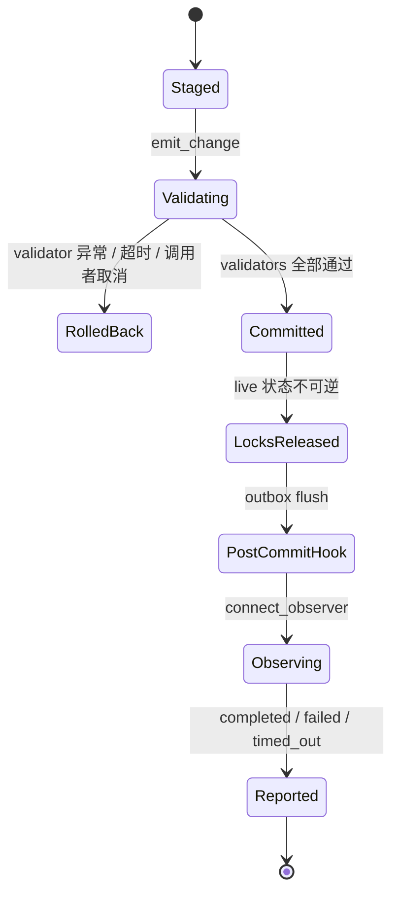

# WS + Config v2 Experimental Alpha 集成报告

**报告日期**：2026-07-23

**版本标识**：`v6.0.0-alpha.NEXUS-OVERDRIVE.20260722.1`

**工作分支**：`integration/dev-v2-dev-all-plugins`

**基线 HEAD**：`b5e872815a3ea5eef81fc3fd34eb0dc71db32d4e`

**成熟度**：Experimental Alpha

> 本报告描述的是基线 HEAD 之上的当前集成工作树。工作树仍包含未提交改动，单独使用上面的 HEAD 不能还原本报告所述状态。

## 1. 验收结论

当前实现已把 Config v2 实验框架、主 WebSocket 重构、HTTP/WS 本地进程鉴权、客户端重放保护、脚本页搜索和前端内容安全纳入同一 Alpha 基线，并通过现有自动化回归。

本轮结论应准确理解为：

- Config v2 默认仍为 `shadow`，旧版 JSON 仍是唯一权威配置源；
- 启动时为 8 个已连接的宿主配置根注册 schema-bound codec；未知文件、未知字段、序列化归一化有损或敏感字段保护无法证明时，仍不生成或覆盖 TOML；
- WS 对外信封保持 `{id, type, data}`，没有新增并行的顶层协议；
- 状态修改接口具备本地地址、Origin 和进程令牌边界；
- 自动化测试覆盖了本报告列出的回归场景，但未进行真实游戏、真实账号或真实设备 E2E，因此不能据此宣称“零 bug”。

## 2. Config v2

### 2.1 模式与兼容边界

`app/configuration/__init__.py` 将 `AUTO_MAS_CONFIG_V2_MODE` 的默认值设为 `shadow`，并在值无效时回退到 `shadow`。代码仍定义 `off`、`shadow`、`canary` 和 `authoritative` 四种模式，但当前 Alpha 的安全基线是：

| 项目 | 当前行为 |
|---|---|
| 权威来源 | 旧版 JSON |
| 默认模式 | `shadow` |
| 启动期 codec | `Config.json`、`EmulatorConfig.json`、`PlanConfig.json`、`ScriptConfig.json`、`QueueConfig.json`、`ToolsConfig.json`、`PluginConfig.json`、`GameSignAccounts.json` |
| 无 codec / codec 未声明保护敏感字段 | 预检失败，跳过写出，不改动已有文件 |
| round-trip 不一致 | 记录差异路径，跳过写出 |
| 可写条件 | 文件专用双向 codec、显式 `secrets_protected=True`、round-trip 完全一致 |

`ConfigService` 只为 `AppConfig.init_config()` 已连接的 8 个根注册 codec，并在 shutdown 或初始化失败时注销。codec 从当前 schema 的密文快照编码，不复制任意输入键；预检再以真正的 TOML 序列化/反序列化结果与 legacy JSON 做逐路径比较。因此未知文件、未知字段、`None` 丢失或 Path/UUID 归一化差异都会 fail closed。现有 shadow 文件在预检失败时同样不会被删除。

### 2.2 事务、原子更新与 revision

- `TransactionContext` 和单节点提交帧绑定创建它们的 `asyncio` Task；被子 Task 继承的 context 会在 `assert_owner()` 中被拒绝。
- 外层异步事务由 manager 事务锁串行化，节点提交另有节点级 lock；嵌套事务复用同一事务 ID。
- 批量字段提交失败时恢复此前字段，更新不会留下部分结果；节点激活失败保持 `INACTIVE`，不残留工作区。
- 事务 outcome 只允许从 `pending` 单向进入 `committed` / `rolled_back`；post-commit hook 等待期间取消不会把已提交批次重新塞回 staging，pre-commit 取消仍会回滚并保留原批次。
- `update()` 按请求模型的顶层及 Group `model_fields_set` 执行 PATCH；缺省字段不再用默认值覆盖 live，显式默认值、`None` 和 encrypted 字段仍是有效更新。
- signal receiver 由框架侧弱引用 registry 管理，普通函数、异步 bound method 和 callable object 使用同一注册/解注册语义；重新取得的 bound method 可断开，receiver GC 后不会继续回调。
- manager 为每个外层事务分配进程内单调递增 revision；配置变更事件携带明确的 `transactionId` 和 revision。该 revision 是当前进程内排序号，不是跨重启的持久化序列。

### 2.3 pre-commit validator 与 after-commit observer

Config 变更回调已经拆成两条语义不同的链：

| API | 时机 | 失败语义 | 允许的职责 |
|---|---|---|---|
| `connect_validator` / `disconnect_validator` | 事务工作区提交前 | 抛错、超时或调用者取消会拒绝并回滚事务 | 纯校验、ref 完整性、同一事务内的受控配置修正 |
| `connect_observer` / `disconnect_observer` | live 已提交、事务与节点锁均释放、post-commit transport hook 完成后 | 异常或超时只写入结构化报告与脱敏日志，不回滚 live | WS/缓存失效、遥测等提交后副作用 |

旧 `connect` / `disconnect` 为兼容已有 ref/校验代码，仍映射到 validator，并发出 `DeprecationWarning`；旧 `send` 同样作为 `emit_change` 的弃用别名。迁移时，能否否决事务的逻辑改用 `connect_validator`，所有不可回滚副作用必须移到 `connect_observer`。

validator 返回 coroutine 时，框架只为该 coroutine 创建并临时授权一个受控 Task；完成、超时或取消后会 join 并撤销事务/node-frame 授权。validator 或 observer 返回已有 `Task` / `Future` 时，其所有权仍属于调用方，框架等待超时不会取消它；受控 coroutine 即使正在等待这类共享对象，取消也不会向共享对象传播。

observer 锁外串行执行并允许安全重入新事务。每个事件生成 `AfterCommitObserverReport`，只包含 transaction ID、revision、事件定位、receiver 标签、结果状态和异常类型，不保存异常文本或配置值；显式外层事务退出后可从 `TransactionContext.observer_reports` 读取。慢 observer 的框架自有 coroutine 会被取消并完成清理，observer 自身失败不会阻止同事件的后续 observer。



### 2.4 持久化、加密与清理

- TOML 在目标目录内先完成序列化和临时文件写入，再执行 `flush`、可选 `fsync` 和 `os.replace`。
- 写入前会对真实 TOML 文本执行 `tomllib.loads` 并做结构、长度和值类型等价检查；dict/list 中的 `None` 等有损形状在接触目标文件前 fail closed。
- 覆盖已有文件前可创建恢复备份；替换失败时保留原文件和恢复副本，写盘或恢复错误继续向上传播，不伪装为成功。
- legacy `ConfigBase` 与 Config v2 `EncryptedValue` 统一使用 `app.utils.security` 的 `DPAPI:v1:<blob>` 格式和 application entropy；不再维护两套可漂移的 DPAPI 实现。Pydantic/FastAPI 默认 transport 序列化仍返回前端逻辑明文并携带响应式字段，`to_dict(if_decrypt=False)` 仍只返回密文且不携带响应式字段。
- 约束型 encrypted 字段对明文和已持久化密文执行同一 inner validator；未被规范化的合法密文原样复用。无效加密 Body 使用掩码 carrier 进入 Pydantic 错误，真实 FastAPI 422 不回显明文。
- 默认读路径兼容历史 `ConfigBase` 裸 blob 与 Config v2 `DPAPI:<blob>`，也兼容二者的 `entropy=None` 密文；成功读取后返回迁移状态并在现有原子提交/Config v2 flush 中惰性重包。legacy 审计日志只记录数量，Config v2 `EncryptedValue.migration_outcome()` 返回 `legacy_dpapi_rewrapped_to_v1`，均不携带明文或密文。
- 当前版本前缀或标准 DPAPI blob 头可识别但无法解密时 fail closed，原文件不会被“数据损坏”占位密文覆盖；Config v2 密文导出也会先校验/重包，损坏值不能原样穿透到下一次写盘。历史明确明文的首次加密兼容保留。
- 上述存储强化不改变产品边界：`ConfigBase.toDict()` / API 仍向已认证前端返回逻辑明文，`toDict(if_decrypt=False)` 和磁盘仍只保留密文。
- encrypted 字段事件只携带 `changed` / `encrypted` 等元数据，不携带新旧值；配置 outbox 同样不会把明文或密文值放上线路。
- ConfigGroup 的可变业务值、FieldChangeEvent 新旧值以及 ConfigCollection 的公开 `order` / `data` 都返回防御性快照；结构修改只能通过整值 stage 或 collection API 后 commit。
- root 文件登记同时校验 UUID 与规范化绝对路径唯一性（含 Windows 大小写别名）；owner 清理同步释放路径索引。多 root flush 逐根尝试，健康根仍写入，末尾只以 uid/path 聚合失败。
- manager 提供按 root、collection、插件 owner/generation 清理注册项的接口；`dispose_node()` 在移除持久化 root 前先 `flush()`，`shutdown_runtime()` 也等待配置 flush 完成。

### 2.5 post-commit outbox

- outbox 按明确的 transaction ID 分桶；提交只 flush 自己的桶，回滚只 discard 自己的桶。
- 桶的 enqueue/flush/discard 使用锁保护；publisher 另用全局 flush lock 串行化提交后的发送，防止较慢的早期提交在 WS 上被后续提交超越。
- 回滚不发送 `config.changed`；发送层失败不会反向回滚已经提交的配置，也不会掩盖原事务异常。
- 可恢复状态缓存按 `(id, type)` 隔离并维护单调 revision；日志、命令和对话响应等不可合并事件不进入状态缓存。

## 3. WebSocket 主链路

### 3.1 稳定契约

`app/core/ws/protocol.py` 通过 `WSEnvelope` 解析和构造消息，所有主链路消息保持：

```json
{
  "id": "Main",
  "type": "event.name",
  "data": {}
}
```

旧版 `Config.send_websocket_message` / `send_json` 通过兼容委托进入同一 publisher，未知插件消息保留原 `id`、`type`、`data`，不按名称猜测重分类。

### 3.2 鉴权、Origin 与连接替换

- 主 WS 只接受 loopback peer 和受信 Origin；连接必须提供由进程 owner token 派生的认证 subprotocol。
- 未认证连接在 accept 前以策略错误拒绝，不能替换当前合法连接。
- 新合法连接原子替换旧连接，旧连接使用 close code `4001` 和原因 `connection replaced` 关闭。
- 旧连接协程和旧连接中尚未完成的消息不能清除、改投或污染新连接。

### 3.3 Ping、并发与关闭

- `Signal` 中的 `Ping` 在业务分发前直接回复 `Pong`；长命令在受限、被跟踪的后台任务中执行，不阻塞接收循环的心跳。
- 入站业务任务有数量上限；超限命令获得明确失败响应，而不是无限堆积。
- 主连接与反向连接的应用层消息上限均为 4 MiB，超限使用 close code `1009`；Uvicorn 传输层同步固定为 4 MiB，接收队列固定为 64 条，避免超限消息先占用无界内存。
- 主连接出站发送使用 64 条 FIFO 有界队列和 5 秒发送超时；慢消费者会被明确关闭，旧连接已排队消息不会转投新连接。
- shutdown 先停止 hook、关闭连接，再等待已接受的 inflight 命令完成尾部的 invalidate/discover/publish，避免插件或运行时修改只完成一半。
- `dialog.request` / `dialog.response` 使用 `requestId` 关联；待处理请求在重连后重发，超时或 shutdown 会完成清理。

## 4. HTTP 与辅助 WS 安全

`LocalHTTPSecurityMiddleware` 同时检查来源地址和完整 Origin：

- 非 loopback peer 或非本地 Origin 返回 `403`；恶意 CORS preflight 同样在外层被拒绝；
- `POST`、`PUT`、`PATCH`、`DELETE` 必须提供 `X-AUTO-MAS-Auth-Token`，缺失或不匹配返回 `401`；
- 本地安全 `GET` 不要求写令牌，但仍受 loopback/Origin 边界约束；
- Electron 的 `null` / file Origin 可以携带令牌调用 API，但不能通过 HTTP 元信息自行取得秘密，令牌由 preload IPC 提供；
- 辅助 WS 和插件 WS 网关同样在 accept/路由分发前完成进程令牌与 Origin 校验，未认证请求不能先触发插件查找或核心关闭命令。

## 5. 前端回归与安全修复

### 5.1 非幂等插件写入不重放

`requestPluginActionWithFallback()` 记录 WS 命令是否已经交给传输层：

- 能证明尚未发送时，允许回退 HTTP；
- 已发送或交付状态未知时，`plugins.add/update/delete/reload/install/uninstall` 等写操作不再通过 HTTP 自动重放；
- 只读的 `plugins.get` 保留安全回退能力。

该行为避免响应超时后重复创建、重复删除或重复安装。

### 5.2 脚本管理 Ctrl+F / Command+F

脚本管理页支持 `Ctrl+F` 和 macOS `Command+F` 打开并聚焦搜索，`Esc` 关闭并清理搜索状态，组件卸载时移除键盘监听。搜索覆盖脚本名、显示类型、项目标签、用户名/账号、服务器、启用状态和可见 tag 字段；匹配不区分大小写。

### 5.3 Markdown、富文本与外部 URL

- 公告、更新内容和脚本模板描述的 Markdown 禁用原生 HTML。
- MaaFW 富描述需要原生 HTML 时，先经过标签/属性 allowlist；事件属性、style 和不安全链接被移除，图片来源也受约束。
- renderer 的统一外链入口只接受 `http:`、`https:`、`mailto:`，拒绝 `javascript:`、`data:`、`file:`、自定义协议和模糊相对地址。
- Electron main 的 `open-url` IPC 再执行同一协议白名单，避免调用方绕过 renderer 校验直接进入系统 Shell。

## 6. 自动化验证结果

以下数字来自本轮已执行的现有测试套件；各 focused 行均已包含在宿主全量测试中，不应与 407 再相加。

| 范围 | 结果 | 说明 |
|---|---:|---|
| 宿主 Python | **407 passed** | `tests/` 全量；另有 1 条外部 Starlette/httpx deprecation warning |
| Config v2 + legacy focused | **109 passed** | Task ownership、PATCH、validator/observer 拆分、共享 Task 取消隔离、锁外重入、signal 弱引用、Pydantic/FastAPI、真实 Windows DPAPI application entropy、共享 v1 格式、ConfigBase 裸 blob 跨入口读取与 legacy/v2 惰性迁移、TOML fail-closed、多 root flush、写盘恢复、outbox、revision、schema-bound legacy preflight |
| WebSocket focused | **63 passed** | 传输/应用层 4 MiB 上限、64 条有界队列、慢消费者、替换竞态、旧消息隔离、反向会话清理、publisher 缓存边界及无副作用导入边界 |
| 前端 Vitest | **20 files / 172 tests passed** | 含 WS 写入重放保护、脚本页搜索和外链协议测试 |
| 前端静态门禁 | **通过** | ESLint、Vue typecheck、Electron TypeScript compile |
| 专项仓库 | **79 passed** | HSR 25、M9A 1、MaaFW 44、MXU 1、MaaEnd 2、MAA script 6 |

WS/HTTP 回归测试还明确覆盖：稳定信封、无 `id` Ping、认证失败不可替换连接、`4001` 替换、旧连接消息隔离、长命令不阻塞心跳、事务 outbox 隔离、dialog 重连、恶意 Origin/CORS 拒绝、辅助 WS 与插件网关的 accept 前鉴权。

## 7. 仍然存在的边界

1. Config v2 仍是实验路径；现有 8 个 schema-bound codec 只承担 shadow/canary 无损预检与辅助写出，旧 JSON 仍是运行时读写权威源。其他配置文件必须逐文件实现并审查双向 codec、敏感字段策略、未知字段保留和回滚流程。
2. `authoritative` 尚未实现完整的启动读取与运行期写入 source-of-truth，因此初始化会明确拒绝该模式；不应在现有 profile 上直接启用。
3. 本轮没有真实游戏、真实账号、真实模拟器/ADB、真实 Win32 控制器或第三方服务端到端验证；专项测试主要是自动化与隔离环境验证。
4. 自动化通过说明已知回归得到覆盖，不等同于产品不存在未知缺陷；本版本仍应按 Alpha 渠道发布并收集日志。
5. 当前集成工作树尚未以 commit/tag 固化；在形成正式贡献或可追溯发布点前，需要另行审核 diff、拆分提交和确认发布边界。
6. validator/observer 的 coroutine 取消仍遵循 Python cooperative cancellation；第三方回调不得吞掉 `CancelledError` 后无限阻塞。
7. 共享 `Task` / `Future` 在 observer 超时后仍可能按其所有者的生命周期继续执行，这是“不越权取消”的设计结果；需要严格截止的 observer 应直接返回自己的 coroutine。
8. coroutine 取消隔离使用 CPython 3.12 `asyncio.Future` 的 hand-off 标记；项目升级 Python 时必须复跑 `test_signal_phase_semantics.py`。
9. 历史 `ConfigBase` 裸格式没有外层标签；若损坏同时破坏了标准 DPAPI blob 头，无法在所有情况下与历史明文作数学上的无歧义区分。当前实现对保留 blob 头的损坏值 fail closed，新写入的 `DPAPI:v1` 则始终可明确识别；迁移前仍应保留配置备份。
10. 4 MiB、64 条和 5 秒是当前 Alpha 的保守边界；尚未完成 30 分钟/10k 消息真实 Electron soak，正式渠道前仍需根据峰值消息与慢消费者数据复核参数。

## 8. 关键证据索引

| 关注点 | 源码 / 测试 |
|---|---|
| Config 模式与 legacy preflight | `app/configuration/__init__.py`、`app/configuration/compat/__init__.py`、`app/core/config_service.py`、`tests/configuration/test_config_v2_exp_alpha.py` |
| 事务、validator/observer、revision、cleanup、flush | `app/configuration/v2/signals.py`、`app/configuration/v2/manager.py`、`app/configuration/runtime/__init__.py`、`tests/configuration/test_signal_phase_semantics.py` |
| 原子 TOML、共享版本化 DPAPI 与 legacy encrypted set | `app/configuration/v2/wire.py`、`app/configuration/v2/encrypted.py`、`app/configuration/v2/support/security.py`、`app/utils/security.py`、`app/models/ConfigBase.py`、`tests/configuration/test_dpapi_entropy_migration.py` |
| WS 信封、鉴权、替换、心跳、drain | `app/core/ws/protocol.py`、`security.py`、`manager.py`、`publisher.py`、`tests/ws/` |
| HTTP 本地安全 | `app/core/http_security.py`、`tests/http/test_http_security.py` |
| 插件写入重放保护 | `frontend/src/views/pluginActionTransport.ts` 及其测试 |
| 脚本页搜索 | `frontend/src/views/scripts/scriptPageSearch.ts` 及其测试 |
| XSS / 外链协议 | `frontend/src/utils/openExternal.ts`、`MaaFWDescriptionView.vue`、Electron `main.ts` 及相关测试 |
